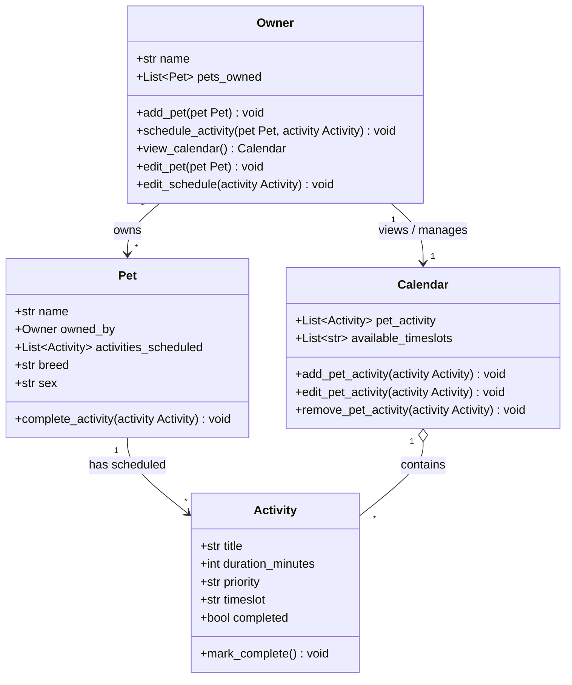

```mermaid
classDiagram
    %% PawPal+ — UML based on the "Initial design" section of reflection.md.
    %% Owner, Pet, and Calendar come straight from the initial design.
    %% Activity is added to represent the "activity" referenced by every other
    %% class (activities_scheduled / pet_activity / schedule activity).

    class Owner {
        +str name
        +List~Pet~ pets_owned
        +add_pet(pet Pet) void
        +schedule_activity(pet Pet, activity Activity) void
        +view_calendar() Calendar
        +edit_pet(pet Pet) void
        +edit_schedule(activity Activity) void
    }

    class Pet {
        +str name
        +Owner owned_by
        +List~Activity~ activities_scheduled
        +str breed
        +str sex
        +complete_activity(activity Activity) void
    }

    class Activity {
        +str title
        +int duration_minutes
        +str priority
        +str timeslot
        +bool completed
        +mark_complete() void
    }

    class Calendar {
        +List~Activity~ pet_activity
        +List~str~ available_timeslots
        +add_pet_activity(activity Activity) void
        +edit_pet_activity(activity Activity) void
        +remove_pet_activity(activity Activity) void
    }

    Owner "1" --> "*" Pet : owns
    Pet "1" --> "*" Activity : has scheduled
    Owner "1" --> "1" Calendar : views / manages
    Calendar "1" o-- "*" Activity : contains
```
