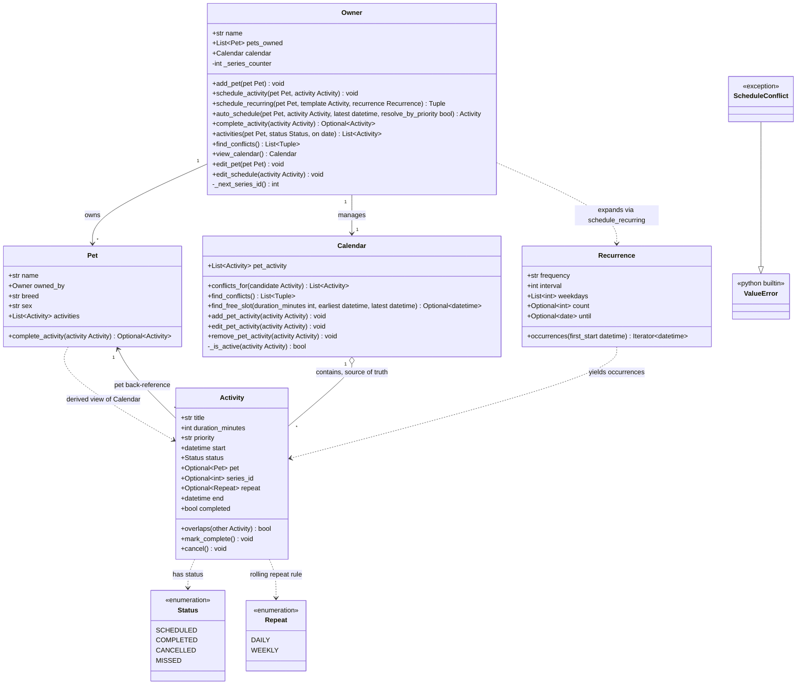

```mermaid
classDiagram
    %% PawPal+ — UML reflecting the FINAL implementation in pawpal_system.py.
    %% Time is modelled as a real interval (Activity.start + duration -> end),
    %% enabling chronological sorting, true overlap detection, and recurrence.
    %% The Calendar is the single source of truth; Pet.activities is a derived
    %% view filtered from it.

    class Owner {
        +str name
        +List~Pet~ pets_owned
        +Calendar calendar
        -int _series_counter
        +add_pet(pet Pet) void
        +schedule_activity(pet Pet, activity Activity) void
        +schedule_recurring(pet Pet, template Activity, recurrence Recurrence) Tuple
        +auto_schedule(pet Pet, activity Activity, latest datetime, resolve_by_priority bool) Activity
        +complete_activity(activity Activity) Optional~Activity~
        +activities(pet Pet, status Status, on date) List~Activity~
        +find_conflicts() List~Tuple~
        +view_calendar() Calendar
        +edit_pet(pet Pet) void
        +edit_schedule(activity Activity) void
        -_next_series_id() int
    }

    class Pet {
        +str name
        +Owner owned_by
        +str breed
        +str sex
        +List~Activity~ activities
        +complete_activity(activity Activity) Optional~Activity~
    }

    class Activity {
        +str title
        +int duration_minutes
        +str priority
        +datetime start
        +Status status
        +Optional~Pet~ pet
        +Optional~int~ series_id
        +Optional~Repeat~ repeat
        +datetime end
        +bool completed
        +overlaps(other Activity) bool
        +mark_complete() void
        +cancel() void
    }

    class Calendar {
        +List~Activity~ pet_activity
        +conflicts_for(candidate Activity) List~Activity~
        +find_conflicts() List~Tuple~
        +find_free_slot(duration_minutes int, earliest datetime, latest datetime) Optional~datetime~
        +add_pet_activity(activity Activity) void
        +edit_pet_activity(activity Activity) void
        +remove_pet_activity(activity Activity) void
        -_is_active(activity Activity) bool
    }

    class Recurrence {
        +str frequency
        +int interval
        +List~int~ weekdays
        +Optional~int~ count
        +Optional~date~ until
        +occurrences(first_start datetime) Iterator~datetime~
    }

    class Status {
        <<enumeration>>
        SCHEDULED
        COMPLETED
        CANCELLED
        MISSED
    }

    class Repeat {
        <<enumeration>>
        DAILY
        WEEKLY
    }

    class ScheduleConflict {
        <<exception>>
    }

    class ValueError {
        <<python builtin>>
    }

    %% Structural relationships
    Owner "1" --> "*" Pet : owns
    Owner "1" --> "1" Calendar : manages
    Calendar "1" o-- "*" Activity : contains, source of truth
    Activity "*" --> "1" Pet : pet back-reference
    Pet ..> Activity : derived view of Calendar

    %% Behavioural / dependency relationships
    Owner ..> Recurrence : expands via schedule_recurring
    Recurrence ..> Activity : yields occurrences
    Activity ..> Status : has status
    Activity ..> Repeat : rolling repeat rule
    ScheduleConflict --|> ValueError
```
